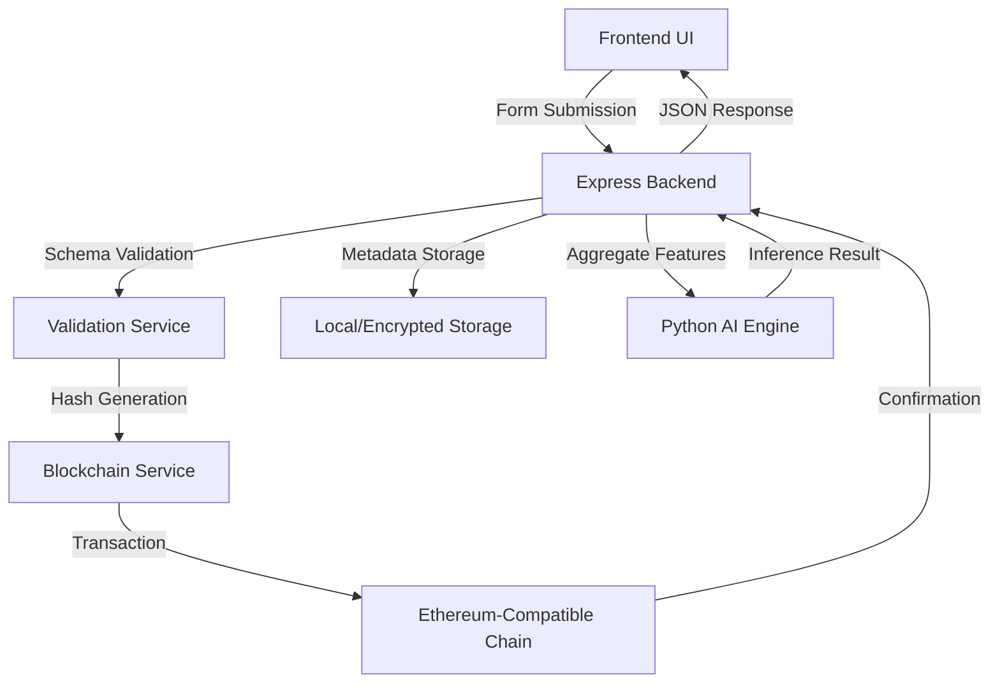

# 📄 EV Battery Passport - Technical Documentation

## 🏗️ Project Overview
The **Blockchain-Enabled EV Battery Passport** is a secure, circular-economy platform designed to track the entire lifecycle of electric vehicle batteries. It ensures data integrity, transparency, and provides AI-driven insights for second-life applications.

---

## 🛠️ Tech Stack

### Frontend
- **Framework**: Next.js 14+ (App Router)
- **Styling**: Tailwind CSS (Professional White Theme / Dark Overhaul available)
- **Icons**: Lucide React
- **State Management**: React Context API (Auth, Wallet)

### Backend
- **Server**: Node.js with Express
- **API**: RESTful API for blockchain interaction and AI inference
- **Services**:
  - `SyncService`: Automatic on-chain to off-chain data synchronization.
  - `BlockchainService`: Robust wrapper for contract interactions.
  - `LogService`: Persistence layer for transaction and system logs.

### Blockchain
- **Language**: Solidity (^0.8.20)
- **Framework**: Hardhat
- **Standards**: ERC-721 (Non-Fungible Tokens for Asset Identity)
- **Security**: OpenZeppelin (AccessControl, ERC721URIStorage)
- **Deployment**: Support for Localhost, Polygon Amoy, and Sepolia.

### AI & Machine Learning (Python Node)
- **Models**:
  - **LSTM (Health)**: Predicts State of Health (SoH) from temporal telemetry.
  - **LightGBM (Reliability)**: Generates Battery Credit Scores based on usage stress.
  - **Gradient Boosting (Longevity)**: Predicts secondary-life operating constraints.
- **XAI (Explainable AI)**: Rule-based reasoning engines to explain AI decisions.

---

## ⛓️ Blockchain Implementation

### "Hash-on-chain, Data-off-chain"
To ensure scalability and cost-efficiency, the system only stores **cryptographic hashes** of lifecycle data on the blockchain. The full metadata resides in a secure off-chain storage layer but remains verifiable against the on-chain hash.

### Smart Contract Logic (`BatteryPassport.sol`)
- **Identity**: Each battery is a unique NFT (`tokenId`).
- **Roles**:
  - `MANUFACTURER_ROLE`: Authorized to mint and record initial specs.
  - `SERVICE_PROVIDER_ROLE`: Authorized to log maintenance and repair events.
  - `RECYCLER_ROLE`: Authorized to decommission, repurpose, or dispose of assets.
- **History**: An append-only array of `LifecycleEvent` structs keeps a tamper-proof audit trail.

---

## 🛰️ System Architecture & Data Flow



1. **Transaction Phase**: Authorized actors log manufacturing, usage, or repair data. 
2. **Anchoring Phase**: The backend submits the data hash to the smart contract, anchoring it to a specific point in time and actor.
3. **Analytics Phase**: When an "Analyze" request is triggered, the backend aggregates historical events (telemetry, repairs, mileage) and feeds them into the AI models.
4. **Insight Phase**: The frontend displays real-time health diagnostics, credit scores, and longevity guidelines.

---

## 📁 Project Structure

```text
root/
├── backend/                # Express API & Core Services
│   ├── src/
│   │   ├── services/       # Blockchain, Sync, Auth, Storage
│   │   ├── routes/         # AI, Passport, Logs endpoints
│   ├── schemas/            # JSON Schemas for lifecycle stages
├── battery-frontend/       # Next.js Application
│   ├── app/                # Pages, Contexts, Components
│   ├── public/             # Static Assets (Logo, Icons)
├── contracts/              # Solidity Smart Contracts
├── scripts/                # Deployment & Interaction Scripts
├── USECASE/                # AI Health (SoH) Inference
├── credit_score/           # AI Reliability (LGBM) Inference
└── optimization/           # AI Longevity (Constraints) Inference
```

---

## 📊 AI Model Details

| Model | Technique | Input | Output |
| :--- | :--- | :--- | :--- |
| **Health (SAP)** | LSTM Neural Network | Voltage, Temp, Current Trends | SoH (%), RUL (Cycles) |
| **Reliability** | LightGBM Classifier | Charge Depth, Fast Charge Ratio | Credit Score, Risk Grade |
| **Longevity** | Gradient Boosting | Cycle Life, Restoration History | Max SoC, ROI Extension |

---

## 📄 PDF Export Instructions
To generate a PDF version of this documentation:
1. Open this file in **VS Code**.
2. Install the **"Markdown PDF"** extension.
3. Right-click and select **"Markdown PDF: Export (pdf)"**.
